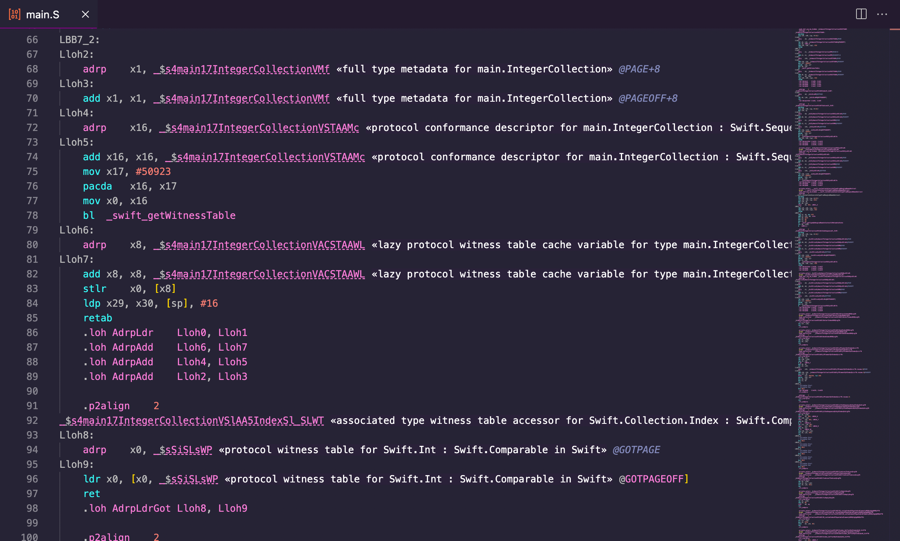
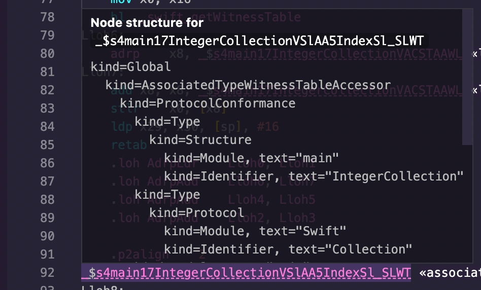

# Symbol Demangler for Visual Studio Code

Have you ever been reading a crash log or disassembly while coding or debugging
that contained mangled symbols and then had to copy and paste them and run a
separate command to demangle them? Or do you frequently find yourself piping
those logs/disassembly outputs into your demangler?

This extension aims to make those workflows a bit easier. Just open an editor
with a file that contains demangled symbols, and the extension will detect
those and add inline decorations that show the demangled symbols.

## Supported Languages

*   C++ (Itanium ABI)
*   Swift (both pre- and post-ABI stability)

## Additional Features

### Quickly copying the demangled symbol

The extension adds a **Copy As > Demangled Symbol** command to the main menu
and editor context menu that copies the demangled form of the symbol where the
cursor is currently located.

**Copy As > Demangled Symbol** can also be accessed by pressing Ctrl+K Ctrl+M
on Linux/Windows and Cmd+K Cmd+M on macOS.

### Hover cards

Languages can support presenting additional information about a symbol when the
user hovers over it in the editor. Currently, only **Swift** supports this by
showing the demangling node structure (i.e., the output of
`swift-demangle --expand`) when hovering over a mangled Swift symbol.

## Requirements

*   Visual Studio Code 1.66 or higher.
*   To demangle C++ (Itanium ABI), the `c++filt` tool must be installed.
*   To demangle Swift, the `swift-demangle` tool must be installed.

For macOS users, the tools above are installed as part of
[Xcode](https://developer.apple.com/xcode/). On other operating systems,
install them using your preferred package manager.

## Extension Settings

Each demangler supports two settings, which can be edited in the Preferences
editor:

*   `demangler.${LANGUAGE_NAME}.toolPath` (string): The path to the executable
    that will be invoked to demangle the symbol.
*   `demangler.${LANGUAGE_NAME}.warnIfToolPathIsInvalid` (boolean): If true,
    the extension will warn on startup if the demangler for that language is
    not available or not executable.
